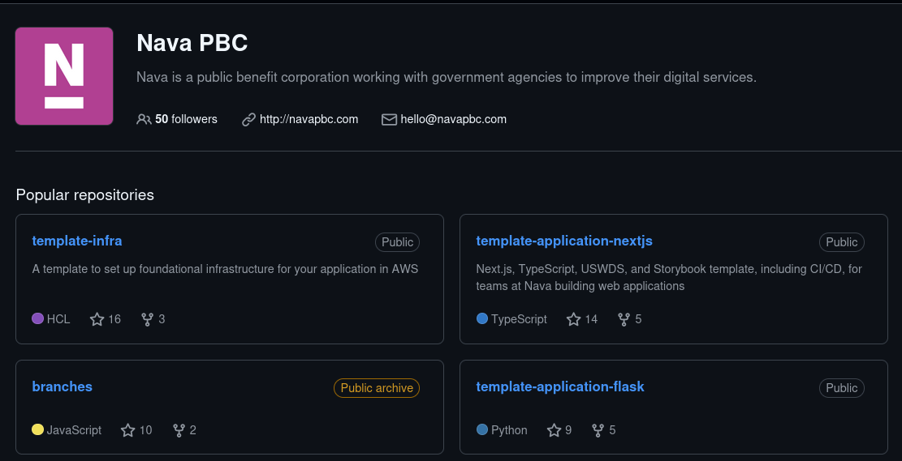
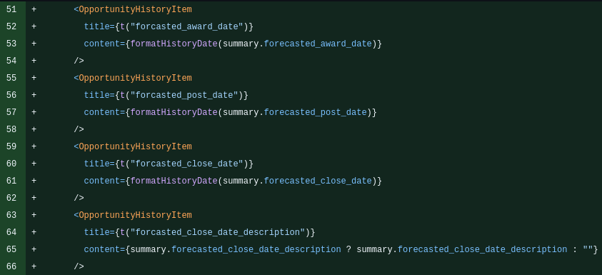
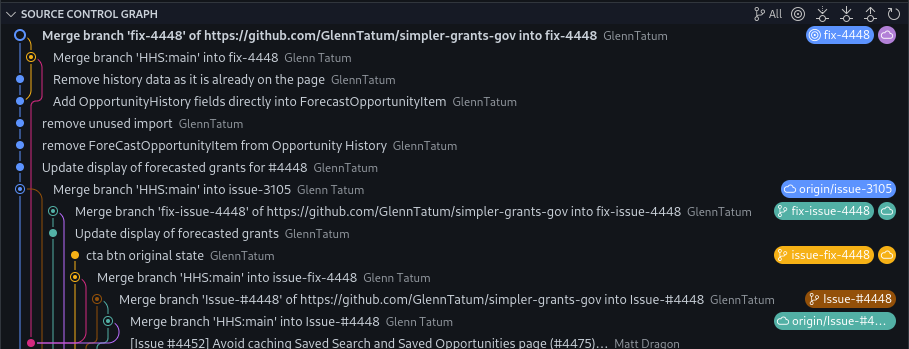

### Why I Picked It

I've had a fascination and interest in public service for a while. Throughout high school, I volunteered with a maritime environmental restoration organization called the Billion Oyster Project in New York City. As an Oyster Research Station Ambassador, I would be frequently tasked with going out to sites throughout the city to check up on the health of our oysters and the maintenance of our research sites.


Now, how do oysters relate to contributing to open source? I can explain. While at the Billion Oyster Project, I created an online Optical Character Recognition application to automate the repetitive task of manually entering the datasheets we fill out into a database. This project, which is linked here [on Github](https://github.com/BillionOysterProjectCommunity/document-processor), used a UI library from a very special organization. The [U.S. General Services Administration](https://github.com/gsa). 

The library I used for my website to style components was called the [United States Web Design System](https://github.com/uswds/uswds) (USWDS) for short. This library was one of the best cohesive UI libraries I have come across in a while. While not as fragmented as tailwind css, or driven by a constantly forked community like Bootstrap, USWDS was perfect for implementing a cohesive user interface.


```html
Tailwind Example

<button class="bg-zinc-100 border font-semibold text-zinc-900 text-sm px-4 duration-200 py-2.5 transition-all hover:border-zinc-300 hover:bg-zinc-200 focus-visible:outline-2 focus-visible:outline-offset-2 focus-visible:outline-zinc-900 active:translate-y-[0.5">
 Tailwind Button
</button>


Bootstrap

<button type="button" class="btn btn-primary">Primary</button>

USWDS

<button class="usa-button" type="button">Default</button>
```

UWDS also uses SASS, which helps when styling for custom branding in terms of different government agencies that
have a different color scheme.

When I heard about the simpler.grants.gov hackathon to contribute towards creating new ideas for making a
more accessible grant discovery system, I was instantly hooked. My passion for public service, computing, and open source
all converged into one opportunity.

Using React w/ USWDS and Flask, both of which tools I have already become experienced with through prior
projects or hackathons (looking at you, React) - From the beginning, simpler.grants.gov was a perfect match for me to start my journey in finding a pathway to contribute towards open source.

<u>A Note on Comm Arch</u>

In our Open Source Class, we participated in an activity where we analyzed different open-source community architectures. Knowing that
simpler.grants.gov is a federation (It is the U.S. government, after all...), being able to be a part of a community with a solid foundation already
laid down in terms of a matured and actively maintained codebase with openness to outside contributors played a large influence in me picking 
simpler.grants.gov as a pathway for contribution. My original idea was going to be to add some fixes to community modules at Ansible, but since 
there are so many different modules to choose from, in addition to my limited experience with the Ansible Python bindings, being able to go head first
into an area where I had just enough experience to advance my skills was important. Contributing to grants looked optimal, as it fit my prior experience
and my interests in public service and developing software for the greater good of society.

### Getting Involved

I first became involved with the community through the simpler.grants.gov Spring 2025 Hackathon.
Throughout the 3 weeks in which the hackathon was hosted, I could directly speak with the developers at "Nava," the contractor
for the simpler.grants.gov project. I attended 3 of their mentorship meetings to seek advice on development and mentorship for working
with the codebase.

In terms of onboarding, it was an effortless experience. For running the stack locally
a `Makefile` was provided to run the backend containers with `docker compose`. Although the backend was practically eating up half 
of my laptops RAM, being that it ran several huge services in combination with a development NextJS server I hosted locally, I faced
no issues with dependencies, and since everything was containerized from the start with volumes binded to my local environment, having
features like hot reloading, and being able to easily teardown and build up the application instantly was a huge time saver. Since then, 
I have incorporated docker compose into more of my project due to the tremendous gains in efficiency you can get with using the utility.
```Makefile
# Makefile Run Command, many different services started simultaneously
init-db init-Opensearch init-localstack init-mock-soap-services
```

For documentation, everything was stored inside the GitHub repository. I wish more repositories would do this and not have esoteric build systems and formatting for documentation, as then you can have a copy of everything locally. It was verbose. For example, here is documentation on the `api`. 
```
├── api
│   ├── api-details.md
│   ├── API-versioning.md
│   ├── authentication.md
│   ├── database
│   │   ├── database-access-management.md
│   │   ├── database-local-usage.md
│   │   ├── database-management.md
│   │   ├── database-testing.md
│   │   └── erds
│   ├── development.md
│   ├── error-handling.md
│   ├── feature-flags.md
│   ├── formatting-and-linting.md
│   ├── images
│   │   ├── health check-response.png
│   │   ├── local-db-cli.png
│   │   ├── local-db-connection.png
│   │   ├── swagger-auth.png
│   │   └── swagger-ui.png
│   ├── lookup-values.md
│   ├── monitoring-and-observability
│   │   ├── human-readable-logs.png
│   │   ├── logging-configuration.md
│   │   └── logging-conventions.md
│   ├── package-dependency-management.md
│   ├── README.md
│   ├── technical-overview.md
│   └── writing-tests.md
```
If you have any questions, the documentation could answer them. When I spoke to engineers at Nava, they said that most of this code was bootstrapped from an open-source template they have on their GitHub.




### The Issue

Once upon a time, we started at issue [#3105](https://github.com/HHS/simpler-grants-gov/issues/3105).

Issue [#3105](https://github.com/HHS/simpler-grants-gov/issues/3105) was addressing the missing feature of "Forecasted" (to be soon posted) grant opportunities of not showing the full metadata of their grant submission. Currently, on grants.gov, if you go to a forecasted grant, you would see the forecasted metadata; however, on simpler.grants.gov, all forecasted grants show a small blurb saying "Forecasted" with no information other than the general overview of the grant. Since organizations depend on knowing the complete details of "Forecasted" grants ahead of time to prepare a strong application, this missing feature on simpler.grants.gov was pretty severe in deteriorating the UX of being able to discover grants easily.

I knew this issue was a minimal fix, only involving updating the React frontend. So I chose it as a good place to get started.

When I picked issue [#3105](https://github.com/HHS/simpler-grants-gov/issues/3105), I wasn't meant to be assigned to it since it was only for internal teams. There labeling for issues wasn't very obvious for anyone visiting the codebase looking to contribute. But since I was a part of the hackathon and actively in touch with the maintainers, they let it slide and got me assigned to the ticket. They were very kind in informing me that only "Help Wanted" tags were designated for external contributors later on.


The first correspondence I made with issue [#3105](https://github.com/HHS/simpler-grants-gov/issues/3105#issuecomment-2712256647) was a small comment explaining a potential change that could be made. [In my comment linked here](https://github.com/HHS/simpler-grants-gov/issues/3105#issuecomment-2712256647), my primary objective in submitting this comment was to get the ball rolling in terms of creating conversations around which part of the codebase needed to be updated to address the issue. I also submitted a small [PR](https://github.com/GlennTatum/simpler-grants-gov/commit/c002df459bad9217807358e2db7dc7c6273a7ad4) as a supplement, so as a team, we could get a sense of which region of the codebase was aiming to be updated. All this PR did was place the metadata where it needed to be with minimal styling.



After my PR, the maintainers linked to the simpler.grants.gov [Figma](https://www.figma.com/design/FGxWtAgToKhehLJCiuy1zL/Simpler.Grants.gov-Project?node-id=4545-4303&t=3hItRRSGvBIjkYhN-1) to visually specify what needed to be changed.

I then sent a screenshot of the current state of the dev build to see if what I developed was what they were aiming for in terms of a feature.

Another maintainer quickly stepped in and saw my PR, and they posted this comment:


When Chris saw the PR, he assigned me to a new ticket [#4448](https://github.com/HHS/simpler-grants-gov/issues/4448)


It seemed as though my contribution to the converstation sparked some internal discussion; there was some desynchronization between the current Figma design and the idea that was in place for what needed to be done about Forecasted grants, between the engineers and designers, and I came at the crossroads of that dilemma to potentially bring some light to the issue and carve a pathway to find a solution.

[#4448](https://github.com/HHS/simpler-grants-gov/issues/4448)

Now that I was assigned to ticket [#4448](https://github.com/HHS/simpler-grants-gov/issues/4448), I was able to make some direct contributions that more aligned with what the team was aiming for in terms of being able to display the metadata for Forecasted grants.

Before making any changes, though, I asked a few questions about specifics. In this very long [comment](https://github.com/HHS/simpler-grants-gov/issues/4448#issuecomment-2776333962), due to some language inconsistencies between the Figma, the design team, and the developers, I was making sure that I was getting everything right.

When Chris (The maintainer) saw my message he responded.


Now that I've submitted my PR with the hopefully 🤞 correct changes. A review will come in soon to get the changes merged.

### Development Experience

As of writing this right now, I would say, "Yeah, this was simple work." But 3 weeks ago, I would have responded completely differently to the complexity of this task. I've never thoroughly investigated a production codebase inside out, let alone run it locally on my computer.

In terms of working on the front end, internally, there were many utilities already built that helped streamline the experience. Not all stuffed away in some `utils/` folder, there were well-typed interfaces and functions that were able to marshall/unmarshal data, call API endpoints, and help with any business logic that was specifically tailored to the simpler.grants.gov codebase.

Adding components, since the primary foundation of the framework was built upon NextJS, was trivial. The build system could do all its magic and hot reload the app to bootstrap everything together for you.

The only hurdle I ran into was git. The number of times I accidentally committed changes to main and detach my head to a previous state was *and then* branch off of that unmodified state was beyond insanity. I probably went to the same stack overflow page 50 times on how to "delete a commit" or "go back to a commit" since I was so oblivious to how git even worked in the first place. So far, any time I face an issue with git, my procedure typically is to:
1. go back to a previous commit
2. cherry pick a commit ahead of me
3. make changes in the merge editor of vscode
4. pray

I think the reason I struggle with git is because it's not linear. Most of my experience with git has been to pull, commit, and push. But now I'm working on multiple features simultaneously; I lose that linearity of a workflow and now enter a tree-like plane of several important points of interest along my journey of making changes. I wish there were better "patterns" for git that are good to follow because as of now, I use it recklessly with disregard for future me, who will have to fiddle around with a merge editor and hope I remembered the exact line-by-line changes I made 3 days ago.





Other than the hardship of dealing with the world's most widely used version control system. Developing new features with React and the USWDS was an enjoyable experience where I learned about the mechanics of Typescript, accessible design patterns, and how NextJS works internally.

### Reflecting on my Effort

I learn by observing those who have more experience than me. How I learn can either be through watching hundreds of hours worth of conference talks, going through the entire call stack of a function to know what it does, or tinkering around with the behavior of a library. As a side effect of this "style" of learning, I hate when programs have hidden behavior or when esoteric syntax implicitly dictates the program's control flow. I now quote from the **Zen of Python**
> Although practicality beats purity.
>
> Errors should never pass silently.
>
> Unless explicitly silenced.

Any behavior, regardless of whether it is an error, should be explicit in how it acts. No action should be left hidden in a system of an indeterministic mess.

Although it may be behind a screenjust like my code, open source requires excellent communication skills. I take pride in how I communicate my ideas to others. When working within these environments of "high-stakes" contributions, where my language used in these public communication channels impacts the time and livelihoods of others, I respect their talent and ideas expressed through speaking clearly.

For my open source contribution, I made sure that the language in my communication was clear and explicit; even if noticeable, I left no assumptions to be made.
> In the face of ambiguity, refuse the temptation to guess.

How I format issues, PRs, and comments comes with a significant amount of attention to detail. Although patience can be my Achilles heel when it comes to my mind saying, "lets just push it to prod", throughout these several weeks of making my first contribution to open source, I feel as if I have made several strides in being able to refine my communication skills to spark discussion and communicate with other engineers to collaborate in these large teams.

*As of April 6th the PR is still awaiting review and waiting to be merged. This entire correspondance was around a months worth of work starting on March 10th, so it's a pretty slow process, but still rewarding!*


